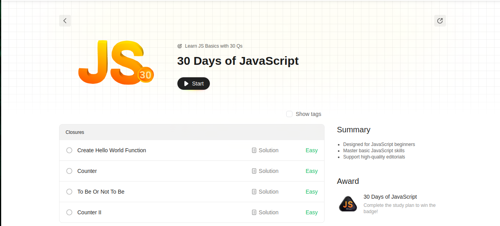

# 30-Days-of-JavaScript

Welcome to the 30 Days LeetCode JavaScript Study Plan! In this repository, you'll find solutions for various coding challenges, each corresponding to a day of the study plan.

## Code

### Day 1: [Create Hello World Function](./createhelloworld.js)
Implement a basic function that prints "Hello, World!" to the console.

### Day 2: [Counter](./counter.js)
Create a counter function that increments a count on each call.

### Day 3: [To Be Or Not To Be](./ToBeOrNotToBe.js)
Explore the concept of truthy and falsy values in JavaScript.

### Day 4: [Counter 2](./counterII.js)
Enhance the counter function to accept an initial value and allow decrementing.

### Day 5: [Apply Transform over Each Element](./ApplyTransform.js)
Implement a function that applies a provided transform function to each element of an array.

### Day 6: [Filter Elements from Array](./filterArray.js)
Create a function that filters elements from an array based on a given condition.

### Day 7: [Array Reduce Transformation](./ArrayReduce.js)
Learn how to use the `reduce` function to transform an array into a single value.

### Day 8: [Function Composition](./functionComposition.js)
Explore function composition by chaining multiple functions together.

### Day 9: [Function Composition](./returnlength.js)
Learn about rest parameter.

### Day 10: [Allow one Function Call](./AllowOneFunction.js)
Use a closure to store the state of the returned function.

### Day 11: [Memorize](./Memorize.js)

## Documentation

### [Arrow Functions](./Arrow%20Functions.txt)
Understand the syntax and usage of arrow functions in JavaScript.

### [Closures](./Closures.txt)
Learn about closures and how they enable encapsulation in JavaScript.

### [Caching](./Caching.txt)
